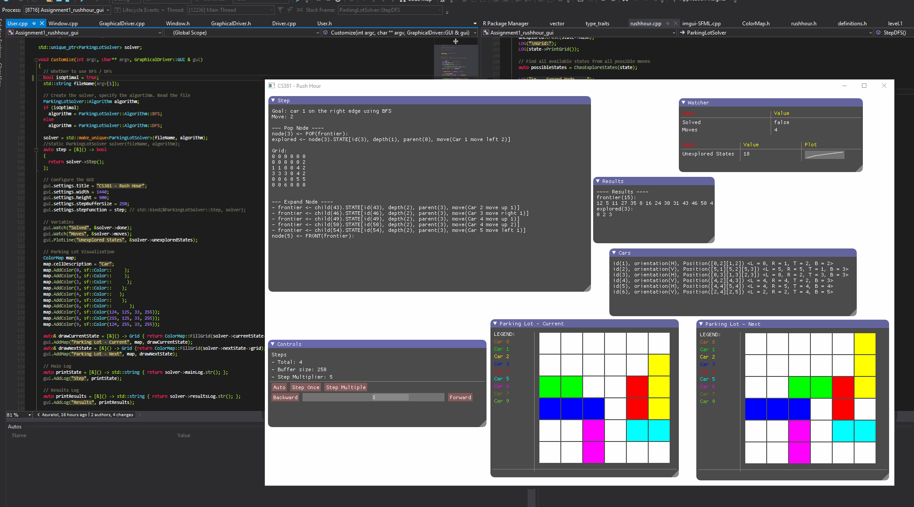

# Oxana
A C++ GUI framework for writing drivers/demonstrations for algorithms that can be  shown in discrete steps. It works by smoothly integrating into existing drivers that work in a stepwise fashion. That is, whenever you have a driver that runs an algorithm by executing some kind of step function like this, it can be easily integrated into the framework and run through the GUI:

The GUI itself is an object which is configured by the user, who sets its main parameters (such as the main step function it will invoke). It also has a few public functions for adding variables to be watched/plotted in synchrony with the step you are currently on. (Note that I opted to include a set buffer size for the number of steps being kept in memory. It will store up to the last *n* steps in memory).

## Installation ##
The Graphical Driver is meant to be executed inside a Visual Studio 2017/15 project, while in debug mode. (It can compile for release too, of course). I have already gone ahead and prepared a project for the user. The user only needs to customize the driver to their needs in the *User* source file.

An example of a working folder structure of the driver being used in action:

The user has added all the files provided by the assignment, then written a custom driver adapted from an instructor-provided one. Given the following original driver provided to us:

It can be adapted to be used with Oxana by using it like this instead:

One of the design goals for Oxana is for it to be easily used as a replacement for existing non-GUI drivers by adapting most of it not all of their source to be run through Oxana instead.

## Features ##

### Custom Logging Windows ###
The GUI allows you to add your own custom stepwise logging functions. That is, they are expected to encapsulate something about the state of a given step and return it in a string.

The function that prints the above is one that I wrote for a customized driver for one of my classes. The code that led to this window being shown was the following:

*Note: For my custom drivers I heavily rely on std::stringstream in order to construct my log per step so that it can be retrieved by my logging functions at the end of the step.*

### Step Controls ###
Using a series of controls, you can step through the driver:

- **Auto**: Keeps stepping until the simulation has completed.
- **Step**: Performs one step.
- **Step Multiple**: Using a defined step multiplier, steps that number of times.
- **Step Slider:** You can use this slider to do a time-line scrubbing through the steps currently stored. That is, those kept currently in the buffer of defined size.

### Watcher ###
You are able to track the current values of any variables with *std::ostream* overloads as well as plot them (integer/float types only). Note that variables keep a history that is updated on every new step. This way they are kept in synchrony with your stepBufferSize.

Adding variables to the watcher is done through invoking the following functions:

### Grid Visualization ###
You can request the driver to draw you the current state of a grid by supplying a function that will provide it per step, as well as a table that will map specific integer indices to colors.

This display was provided by the following code:

### Notifications ###
You can set custom notifications for specific events in the simulation that you care about. For example when a specified variable goes over a certain amount, when a boolean switches value, etc. The user need only provide either a boolean or a function that returns a boolean (for more detailed logic) and a function to compose the message when the notification becomes active.

This custom notification was added by the following code:

## Changelog ##

### Update 1 “CowWatch”: ###
 
- **Bug fix:** All logs and plotted variables are now properly synchronized with stepBufferSize, once the GUI has been initialized.
- **QOL:** The project has been refactored and reorganized in order to make it more flexible (read: faster) when it compares to swapping in and out different drivers. All the user-specific code need only be implemented in User.cpp
- **Feature:** The variable watcher now uses std::stringstream to record the value of the variable. This means that overloading the ostream operator for your custom types will give you custom output!
- **QOL:** The latest values for all watched variables are now recorded on strings kept on the object, preventing constant allocations per frame. 

### Update 2 “Red” ###

- **Bug fix:** Settings for the window context were not being properly updated after the constructor was called. This has been now fixed so you can set custom resolutions!
- **QOL**: Added hotkeys for stepping forward, backward, next, and multiple. These are the left, right and down arrow keys by defaults.
- **Grid display**: You can now request the driver to draw you the current state of a grid by supplying a function that will provide it per step, as well as a table that will map specific integer indices to colors.
- **Notifications**: You can now set up custom notifications for specific events in your simulation. For example:

## Dependencies ##
- [dear imgui](https://github.com/ocornut/imgui): Dear ImGui is a bloat-free graphical user interface library for C++. It outputs optimized vertex buffers that you can render anytime in your 3D-pipeline enabled application. It is fast, portable, renderer agnostic and self-contained (no external dependencies) It is  designed to enable fast iteration and empower programmers to create content creation tools and visualization/ debug tools (as opposed to UI for the average end-user). It favors simplicity and productivity toward this goal, and thus lacks certain features normally found in more high-level libraries.
- [SFML](https://github.com/SFML/SFML): A simple, fast, cross-platform and object-oriented multimedia API. It provides access to windowing, graphics, audio and network. It is written in C++, and has bindings for various languages such as C, .Net, Ruby, Python.
- [imgui-sfml](https://github.com/eliasdaler/imgui-sfml): An excellent wrapper library for using SFML with 'dear imgui'.